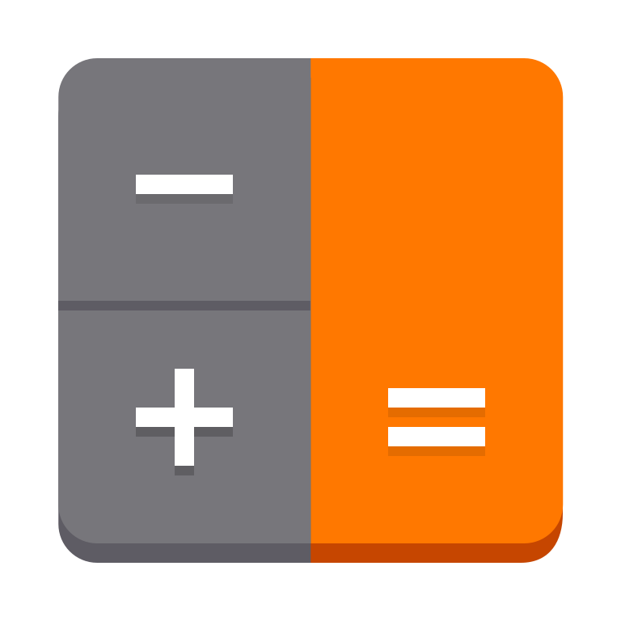
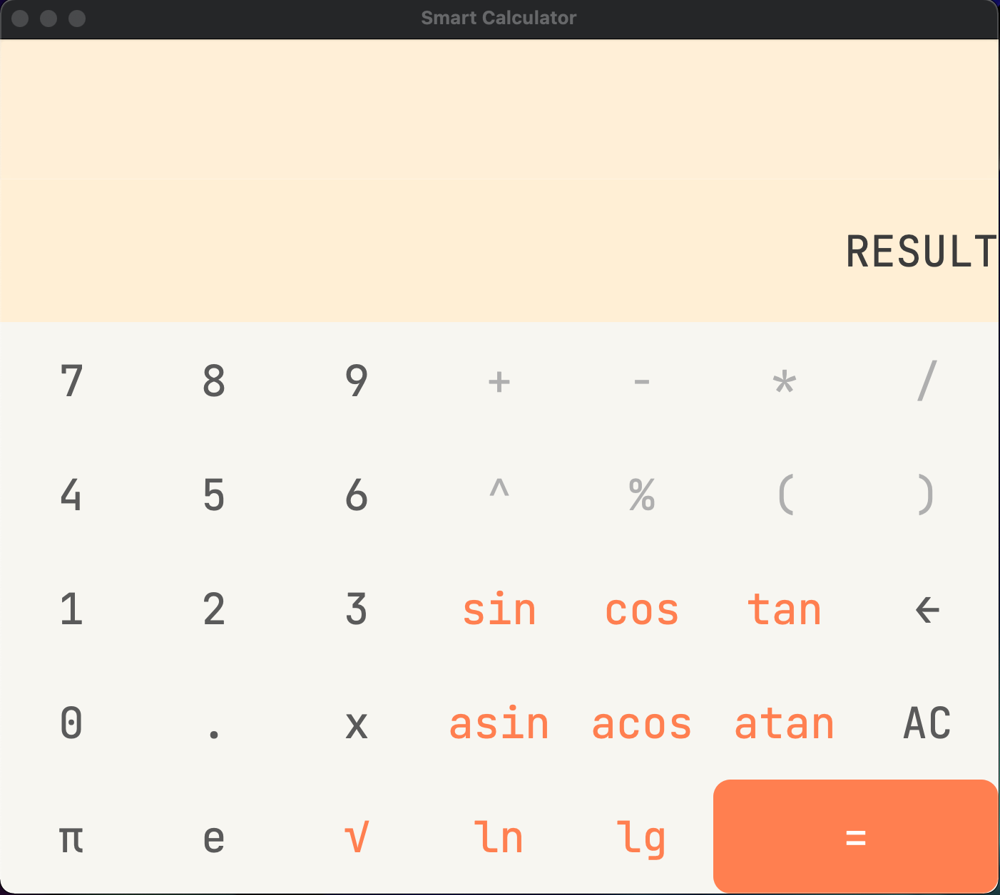
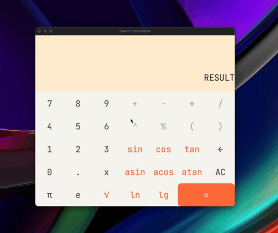
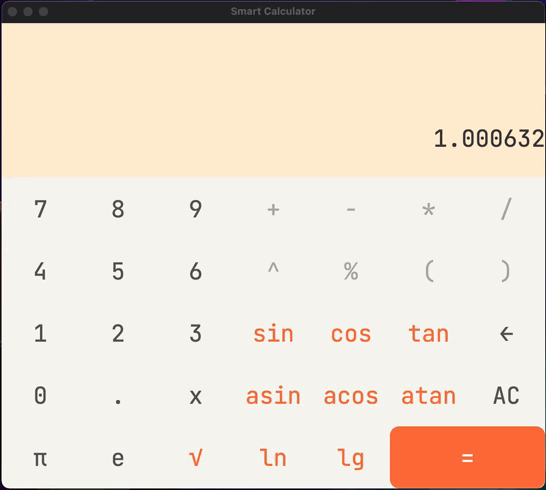
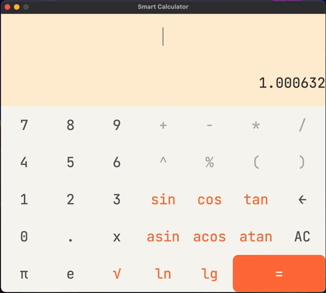
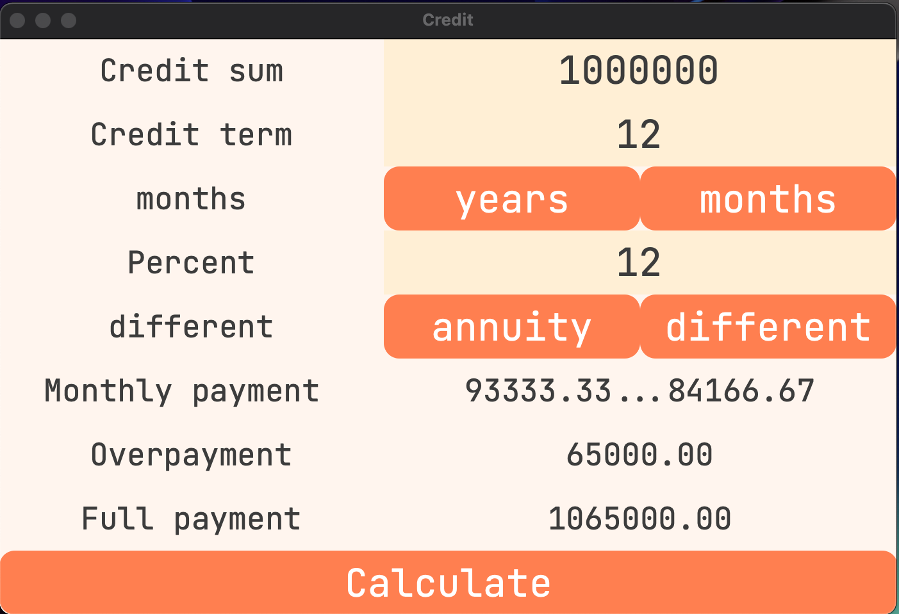
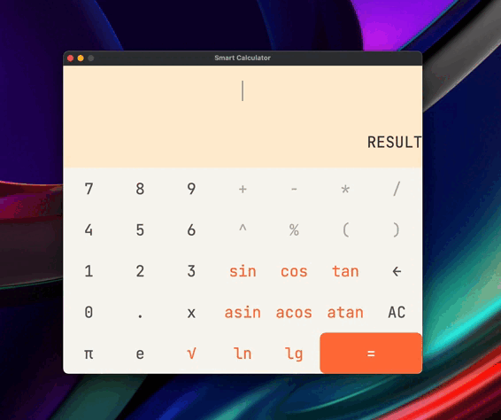

# Smart Calculation

## Content
This project implements a calculator with a graphical interface. It supports both standard mathematical operations and the calculation of some elementary functions, the construction of graphs of functions, the calculation of the value of a function at a specific point, and a loan calculator. For calculations, the calculator uses the reverse Polish notation algorithm, while all graphics are written in Qt.
Appearance of the calculator

## Basic Calculator
The main page contains numbers, operations, functions, constants, special characters and 'x'.
The numbers `0-9` are responsible for entering the corresponding number.
The constant `π` is defined as 3.14, `e` as 2.72 .

`AC` - erases the entire input string, `←` - deletes the last character in the input string, `√` - square root function.
All operations are intuitive.
Correct input is required, namely:

1) The number of opening and closing brackets is the same. `(2+3)*2` - correct notation, `((2+3)*2` - incorrect notation.
2) The arguments of all functions are indicated in brackets. `sin(x)` is valid, `sinx` is invalid.
3) There are no unintended literals in the expression record.
Work example:

## Graphs of function and value at point
In addition to calculating standard mathematical expressions, this calculator supports plotting functions and calculating the value of a function at a certain point.
You can plot or calculate the value of a function if you have `x` in the input string.1) When calculating a value at a function point, you will be prompted to enter it, a value will be substituted in place of `x` and the calculation will be performed.
2) When plotting a function, you will be prompted to specify the domain of the function and the range of values. In the future, the resulting graph can be scaled and moved.
Examples:

## Credit calculator
Additionally, the implementation of a loan calculator is presented, similar to most online loan calculators.
To select it, switch the calculator's mode to the status bar.

Input data:

1) `Credit sum` - loan amount, in any currency.
2) `Credit term` - credit term - numerically.
3) `Term type` - term type, namely months or years.
4) `Percent` - percentage per annum on the loan.
5) `Monthly payment type` - payment type, namely authentic or differential.
Output:

1) `Monthly payment` - monthly payment on the loan (in the case of differential payments, the amount for the first and last months is indicated).
2) `Overpayment` - overpayment on the loan.
3) `Full payment` - the total payment on the loan.
After entering the data, you must click on the `calculate` button - then the calculations will be made.
Work example:

