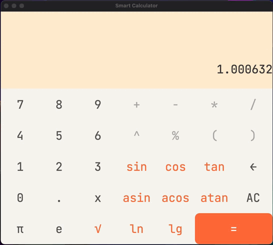

# Smart Calculation v1.0

## Содержание

В данном проекте реализован калькулятор с графическим интерфейсом. Он поддерживает как стандартные математические операции, так и вычисление некоторых элементарных функций, построение графиков функций, вычисление значения функции в конкретной точке и кредитный калькулятор. Для вычислений в калькуляторе используется алгоритм обратной польской нотации, вся графика же написана на Qt.

Внешний вид калькулятора

## Основной калькулятор

На основной странице располагаются числа, операции, функции, константы, специальные символы и 'x'.

Числа `0-9` отвечают за ввод соответствующего числа.

Константа `π` определена, как 3.14, `e` - как 2.72 .

`AC` - стирает всю входную строку, `←` - удаляет последний символ во входной строке, `√` - функция вычисления квадратного корня.

Все операциии интуитивно понятны.

Необходима корректность ввода, а именно:

 1) Количество открывающих и закрывающих скобок - совпадает. `(2+3)*2` - корректная запись, `((2+3)*2` - некорректная запись. 
 2) Аргументы всех функций обозначены в скобках. `sin(x)` - корректная запись, `sinx` - некорректная.
 3) В записи выражения отсутсвуют непредусмотренные литералы.

Пример работы:

## Графики функции и значения в точке

Помимо вычисления стандартных математических выражений, данный калькулятор поддерживает построение графиков функций и вычисление значения функции в определенной точки. 

Построить график или вычислить значение функции можно  при наличии `x` во входной строке.

 1) При вычислении значения в точке функции будет предложенно ввести её, на место `x` будет подставлено значение и произведено вычисление. 
 2) При построении графика функции будет предложено указать область определения функции и область значений. В дальнейшем полученный график можно масштабировать и передвигать.

Примеры:

## Кредитный калькулятор 

Допольнительно представлена реализация кредитного калькулятора, по аналогии с большинством онлайн кредитных калькуляторов.

Чтобы выбрать его, переключите режим работы калькулятора на status bar.

Входные данные:

 1) `Credit sum` - сумма кредита, в любой валюте.
 2) `Credit term` - срок кредита - численно.
 3) `Term type`- тип срока, а именно месяцы или года.
 4) `Percent` - процент годовых по кредиту.
 5) `Monthly payment type`- тип выплат, а именно аутиентные или диффериентные.

Выходные данные:

 1) `Monthly payment` - месячная выплаты по кредиту (в случае диффериентных выплат указывается сумма за первый и последние месяца). 
 2) `Overpayment` - переплата по кредиту.
 3) `Full payment` - общая выплата по кредиту.

После введения данных необходимо нажать на кнопку `calculate` - тогда и будут произведены расчёты.

Пример работы:

