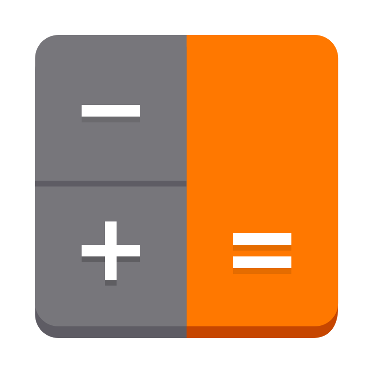
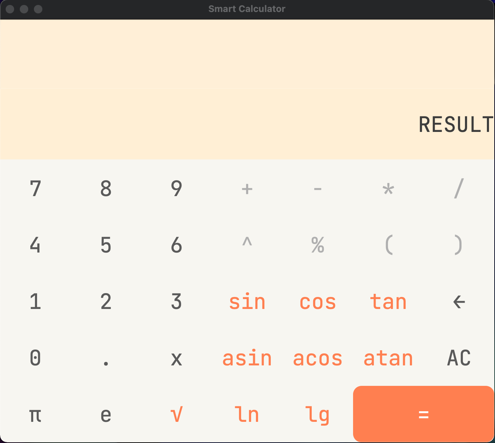

# Smart Calculation

## Содержание

В данном проекте реализован калькулятор с графическим интерфейсом. Он поддерживает как стандартные математические операции, так и вычисление некоторых элементарных функций, построение графиков функций, вычисление значения функции в конкретной точке и кредитный калькулятор. Для вычислений в калькуляторе используется алгоритм обратной польской нотации, вся графика же написана на Qt.

Внешний вид калькулятора

### Основной калькулятор

На основной странице располагаются числа, операции, функции, константы, специальные символы и 'x'.

Числа `0-9` отвечают за ввод соответствующего числа.

Константа `π` определена, как 3.14, `e` - как 2.72 .
